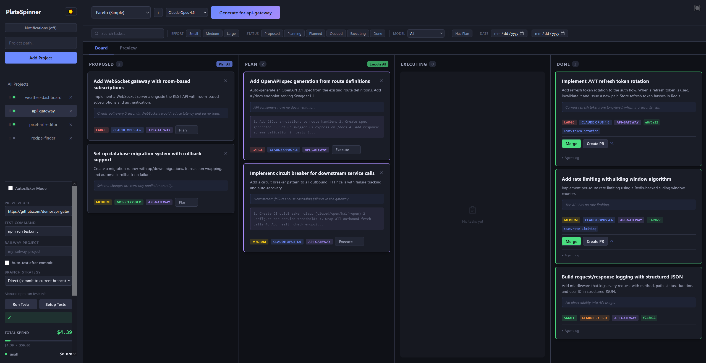

# PlateSpinner

A kanban board that orchestrates AI coding agents. Point it at your local projects, describe what you want built, and PlateSpinner spawns headless AI sessions (Claude Code, Codex, or Gemini CLI) to generate tasks, plan implementations, write code, and commit changes — while you watch from a drag-and-drop board.



## How It Works

PlateSpinner manages a three-phase pipeline for each task:

### 1. Propose

Describe what you want ("add dark mode", "refactor the auth module", "find and fix bugs") and PlateSpinner spawns a **read-only** AI session that analyzes your entire codebase. It returns a structured list of tasks, each with a title, description, rationale, and effort estimate. Tasks appear in the **Proposed** column.

You can also use built-in prompt templates like the "Pareto" templates, which ask the AI to identify the highest-impact improvements across your codebase.

### 2. Plan

Click **Plan** on any proposed task. PlateSpinner spawns another read-only AI session that produces a concrete implementation plan — specific files to change, functions to write, tests to add. The plan is stored on the task card and visible before you commit to execution.

### 3. Execute

Click **Execute** and PlateSpinner spawns a **full-access** AI session with write permissions (Read, Write, Edit, Bash). The agent follows the plan, writes code, runs tests, and commits. You see real-time progress via WebSocket — files changed, insertions/deletions, agent output streaming live.

After execution:
- **Diffs** are captured and viewable in the built-in diff viewer
- **Branch-per-task** mode (configurable) creates an isolated branch like `kanban/task-a1b2c3d4-add-dark-mode`
- **Auto-test** can run your project's test suite after each commit
- **Cost tracking** records token usage and dollar cost per task and per project

You review the changes, then push when ready.

## The Autoclicker

The autoclicker is PlateSpinner's fully autonomous mode. Enable it per-project and it runs a continuous loop:

1. An AI **judge** analyzes the project state (existing tasks, git history, test results, budget)
2. The judge decides what to do next: propose new tasks, plan an existing one, or execute
3. PlateSpinner carries out the decision, then loops back to the judge

It's like Cookie Clicker for your codebase — you enable it and watch the tasks flow through the pipeline. Configurable parallelism (up to 10 concurrent agents), per-project budget caps, and automatic backoff on failures keep it from going off the rails.

## Prerequisites

- **Node.js 18+**
- At least one AI CLI tool installed and on your PATH:
  - [Claude Code](https://docs.anthropic.com/en/docs/claude-code) — recommended, supports structured output and tool control
  - [Codex CLI](https://github.com/openai/codex) — optional
  - [Gemini CLI](https://github.com/google-gemini/gemini-cli) — optional

PlateSpinner spawns these as headless child processes. It doesn't call any cloud APIs directly — it invokes the CLI tools the same way you would from a terminal, just non-interactively.

## Quick Start

```bash
git clone https://github.com/moridinamael/platespinner.git
cd platespinner
npm install
npm start
```

The server binds to `localhost` by default. To expose it on the network (e.g., access from another machine), set `HOST=0.0.0.0` and configure `APP_API_TOKEN` for security.

Open [http://localhost:3001](http://localhost:3001), click **Add Project**, and point it at a local codebase directory.

## Development

Run the frontend (Vite) and backend (Express) concurrently with hot reload:

```bash
npm run dev
```

- Frontend: `http://localhost:5173` (proxies API/WebSocket to backend)
- Backend: `http://localhost:3001`

Run tests:

```bash
npm test
```

## Configuration

Copy `.env.example` to `.env` and adjust as needed:

| Variable | Default | Description |
|----------|---------|-------------|
| `HOST` | `127.0.0.1` | Bind address. Use `0.0.0.0` to expose on all interfaces |
| `PORT` | `3001` | Server port |
| `APP_API_TOKEN` | *(none)* | Bearer token required for mutating API requests. Recommended when `HOST` is not localhost |
| `RAILWAY_BIN` | `railway` | Path to Railway CLI binary |
| `DEBUG_AUTOCLICKER` | off | Enable debug logging for autoclicker judgment agent |

### Per-Project Settings

Each project has its own configuration accessible in the UI:

- **Branch strategy** — `branch-per-task` (isolated branches) or `direct` (commit to current branch)
- **Auto-test on commit** — automatically run tests after each execution
- **Test command** — override auto-detected test framework
- **Budget limit** — cap total spend per project (blocks execution when reached)
- **Model selection** — choose which AI model to use (Claude Opus, Gemini Pro, GPT Codex)

## Features

- **Drag-and-drop kanban board** — reorder tasks and projects, move tasks between columns
- **Command palette** (`Ctrl+K`) — quick access to actions and navigation
- **Keyboard shortcuts** — navigate and act without the mouse
- **Dark / light theme** — respects system preference, toggleable
- **Real-time streaming** — WebSocket updates show agent progress, git status, and cost as execution happens
- **Diff viewer** — review every line of AI-generated changes before pushing
- **Agent replay** — inspect the full agent conversation for debugging
- **Batch operations** — select multiple tasks and plan/execute/dismiss them at once
- **Execution queue** — tasks queue up per-project and auto-advance when the previous one finishes
- **Cost tracking** — per-task and per-project cost breakdowns with budget alerts
- **Test framework detection** — auto-discovers npm/pytest/cargo/go/make test setups
- **Notifications** — Slack, Discord, email, webhooks, and browser notifications for task completion, failures, budget alerts, and daily digests
- **Plugin system** — extend with custom hooks, tools, parsers, and validators (see [plugins/README.md](plugins/README.md))
- **Crash recovery** — tasks stuck in transient states (executing, planning, queued) are automatically recovered on server restart

## Architecture

```
src/               → React frontend (Vite)
server/            → Express + WebSocket backend
  agents/          → AI CLI process spawning and output parsing
    cli.js         → Command construction for Claude/Codex/Gemini
    runner.js      → Generation, planning, execution orchestration
    autoclicker.js → Autonomous judge-execute loop
    replay.js      → Agent conversation replay
  routes/          → REST API endpoints
  state.js         → JSON file-based persistence (data/state.json)
  ws.js            → WebSocket server for real-time updates
  testing.js       → Test framework detection and execution
  notifications.js → Multi-channel notification delivery
  digest.js        → Daily email digest generation
  plugins/         → Plugin loader and manager
plugins/           → User plugin directory (loaded at startup)
data/              → Runtime state (gitignored, auto-created)
```

## Supported AI Models

| Model | Provider | Input / Output Cost |
|-------|----------|-------------------|
| Claude Opus 4.6 (default) | Claude Code | $15 / $75 per 1M tokens |
| Gemini 3.1 Pro | Gemini CLI | $2.50 / $15 per 1M tokens |
| GPT-5.3 Codex | Codex CLI | $5 / $15 per 1M tokens |

Models are selectable per-task. Generation and planning phases run in read-only mode regardless of model.

## License

[MIT](LICENSE)
